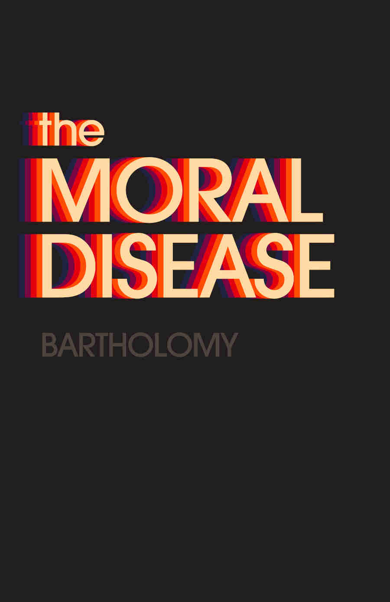

<!-- HACK: Hugo really wants the page to begin with Markdown, and will fail if it starts with a shortcode -->





## [The Moral Disease](https://www.amazon.com/dp/1737889404)

2021

Drawing on Foucault, Nietzsche, Arendt, Freud, and many more, this is a study of moral phenomena from the Axial Age philosophical revolutions, to the religious fervor of late antiquity, to the totalitarian movements of the 20th century, to the latest illuminating tales of the “immorality of morality” in our own impotent, absurd, and yet ominous age. Once again, the spirit of skepticism and healthy thinking is tested against the histrionic fictions of the protofascist: we seem bound to repeat our mistakes, but that should not compel the courageous and rational to preemptive silence.

---

## Apethink

A sequel in some ways, with a more focused attack on evolutionary psychology.

Coming soon...
